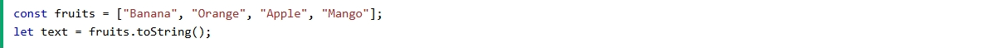

# What is arry in JavaScript ?

### In JavaScript, an array is a special type of object used to store multiple values in a single variable. Unlike many other programming languages, JavaScript arrays can hold values of different types in the same array.

# Array mithod Push

### The push method in JavaScript is used to add one or more elements to the end of an array and returns the new length of the array.

# Array method Pop

### The pop method in JavaScript is used to remove the last element from an array and returns that element. This method changes the length of the array.

## `let fruits = ['apple', 'banana', 'orange'];`
## ` let lastFruit = fruits.pop();`
 ## ` console.log(lastFruit); // Output: 'orange'`
 ## `console.log(fruits);    // Output: ['apple', 'banana']`

 # Array method unshift
### The unshift method in JavaScript is used to add one or more elements to the beginning of an array. It modifies the array and returns the new length of the array after adding the elements.

 # Array method shift

### Метод shift() в JavaScript удаляет первый элемент массива, тем самым уменьшая размер исходного массива на 1

# Array method toString

### Метод Arrays.toString() возвращает строковое представление содержимого указанного массива.

 # Array method indexof

### The indexOf() method compares searchElement to elements of the array using strict equality (the same algorithm used by the === operator). NaN values are never compared as equal, so indexOf() always returns -1 when searchElement is NaN.

# Array method includes

### The includes() method of Array instances determines whether an array includes a certain value among its entries, returning true or false as appropriate.

# array method concat

### The concat() method is used to merge two or more arrays. This method does not change the existing arrays, but instead returns a new array. Try it. Syntax. concat() concat(value0) concat(value0, value1) concat(value0, value1, /* …, */ valueN). Parameters. valueN Optional. Arrays and/or values to concatenate into a new array. If all valueN parameters are omitted, concat returns a shallow copy of the existing array on which it is called.

# Array method slice

### Array slice() method returns selected elements in an array as a new array. It selects from a given start, up to a (not inclusive) given end.

# Array method map

### Метод map() в JavaScript используется для получения модифицированной версии массива или уменьшенного значения с помощью callback-функций.

# Array method farech

### Метод forEach в JavaScript позволяет последовательно перебирать все элементы массива.

# array method find

### In JavaScript, the find() method is an array method used to retrieve the value of the first element in an array that satisfies a provided testing function. It iterates over each element in the array and returns the value of the first element for which the testing function returns true.

